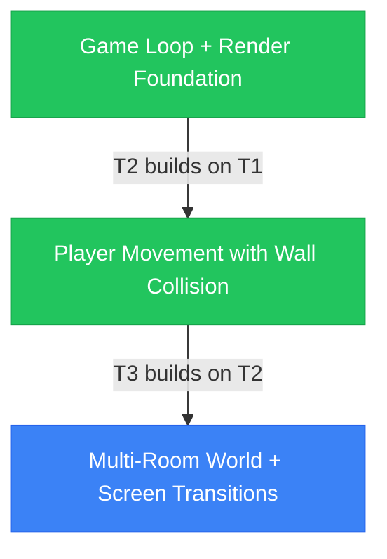
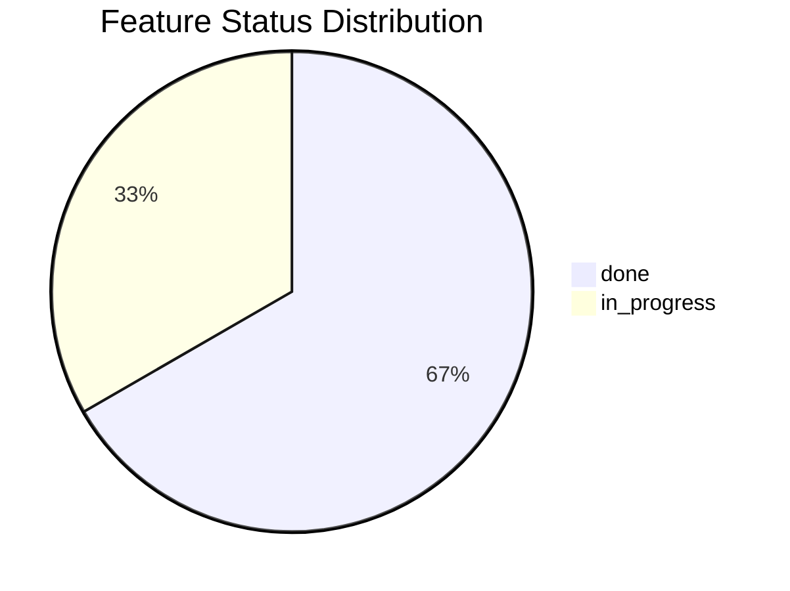

# Project Progress Summary

**Generated:** 2026-05-13  
**Source:** `project-memory/progress/progress.json`

---

## Status Overview

| Status | Count |
|--------|-------|
| done | 2 |
| in_progress | 1 |

---

## Discovery Runs Tracked

| Run ID | Processed |
|--------|-----------|

---

## In Progress

- **T3**: Multi-Room World + Screen Transitions
  - Requirements elicited in elicit-v4/20260513-102248 (63 requirements).

---

## Planned (Discovered, Not Started)

---

## Done

- **T1**: Game Loop + Render Foundation
- **T2**: Player Movement with Wall Collision

---

## Dependency Graph

---

## Status Distribution

